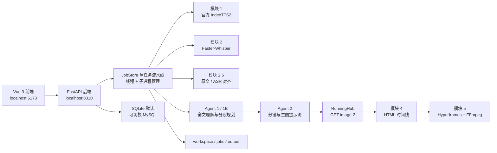
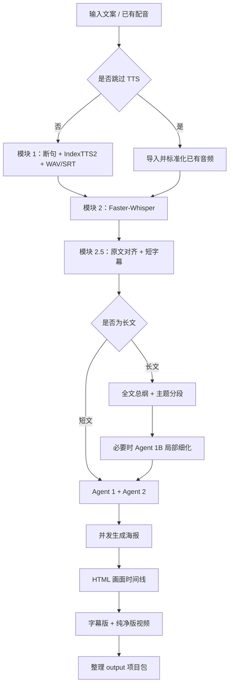

# AI 故事 / 口播视频生成工作台：技术架构与实现总览

> 文档状态：截至 2026-07-15 的现有实现  
> 项目根目录：`G:\trae_voice_over_video`  
> 当前交付形态：Windows x64 便携整合包，尚未封装为单文件 EXE

## 1. 产品定位

本项目是一套“输入文案或已有配音，自动生成横版漫画视频”的本地工作台。目前已经将原来的口播科普版本与故事视频版本合并为同一个应用，共用底层流水线，通过作品模式切换不同的 Agent 策略和画面风格。

当前正式支持两种作品模式：

| 模式 | 标识 | 主要用途 | 默认视觉角色 / 风格 |
|---|---|---|---|
| 都市惊悚 | `urban_suspense` | 鬼故事、都市小说、悬疑故事 | 伊藤润二式惊悚漫画与都市悬疑条漫风 |
| 口播科普 | `science_explainer` | 科普、观点、知识讲解、药学口播 | 黑色短发、红色围巾少女的科教手绘漫画 |

两种模式共用：

- 官方 IndexTTS2 配音；
- Faster-Whisper ASR；
- 原文与 ASR 字幕校准；
- 长文自动分段；
- Agent 规划与提示词生成；
- RunningHub GPT-image-2 生图；
- Hyperframes + FFmpeg 视频合成；
- 停止任务、断点续跑、产物整理和任务历史。

## 2. 应用总体架构



系统采用“Web UI + 本地后端 + 独立模块子进程”的结构：

- 前端只负责输入、状态展示和任务操作；
- FastAPI 负责参数校验、鉴权、任务管理和文件接口；
- `pipeline.py` 负责编排完整生产流程；
- TTS、ASR、生图页面、视频渲染保持为可独立运行的模块；
- 每个重要阶段都写出文件，中间结果可检查、可归档、可复用。

## 3. 技术栈

| 层级 | 技术 |
|---|---|
| 前端 | Vue 3、Vite、原生 CSS |
| 后端 | Python 3.10、FastAPI、Uvicorn、Pydantic |
| 任务编排 | Python Thread、subprocess、进程树终止、文件状态检查 |
| 本地数据库 | SQLite |
| 可选数据库 | MySQL / PyMySQL |
| TTS | 官方 IndexTTS2 2.0.0、本地 PyTorch CUDA、FP16 |
| ASR | Faster-Whisper、CTranslate2、VAD |
| 大模型 | Gemini 原生 API或 OpenAI 兼容中转接口 |
| 生图 | RunningHub 标准模型 API、GPT-image-2 |
| 页面编排 | HTML、CSS、JavaScript 时间线 |
| 视频渲染 | Hyperframes 0.6.88、Headless Chrome |
| 音视频处理 | FFmpeg、NVENC 自动探测 |
| 便携运行时 | 项目内置 Python、Node.js、FFmpeg、模型与缓存目录 |

## 4. 前端应用框架

主界面位于 `frontend/src/App.vue`，目前分为三个页面。

### 4.1 故事视频生成工作台

正式生产页面，包含：

- 项目名称；
- 完整文案输入；
- 使用 IndexTTS2，或上传已有配音并跳过 TTS；
- 本地参考音色上传 / 选择；
- 语速、音量、音调、情绪、并行数等配音参数；
- 长文自动分段开关与字数阈值；
- 都市惊悚 / 口播科普模式切换；
- 默认风格提示词编辑；
- 启动、停止、断点续跑；
- 当前步骤、进度、重点日志；
- 最终视频、音频、字幕和规划文件产物；
- 历史任务分页列表。

产物按钮不会直接触发下载，而是请求后端打开文件所在文件夹。

### 4.2 待开发页面

用于收纳不影响主流程的高级能力，目前包括：

- 完整 Gemini 画面系统指令；
- 实验性高级设置；
- 视频 / 音频 / 字幕剪辑器。

剪辑器目前使用 FFmpeg，可实现：

- 视频起止时间裁剪；
- 原视频音量调整；
- 外部音频混合与延迟；
- SRT / ASS / VTT 字幕烧录；
- 输出 H.264 + AAC MP4。

### 4.3 模块 1 · 仅配音

独立运行 IndexTTS2，不执行 ASR、Agent、生图和视频合成。适合：

- 单独生成长文配音；
- 测试音色与情绪；
- 为其他剪辑项目制作 WAV 和原始 SRT。

## 5. 后端与 API 框架

FastAPI 入口为 `backend/app/main.py`，默认端口 `8010`。

### 5.1 核心接口

| 接口 | 用途 |
|---|---|
| `GET /api/health` | 检查数据库、Gemini、IndexTTS2 和设备状态 |
| `GET /api/settings` | 返回音色、情绪、模式和默认提示词 |
| `POST /api/jobs` | 创建完整视频或模块 1 任务 |
| `GET /api/jobs` | 分页读取任务历史 |
| `GET /api/jobs/{id}` | 查询单个任务状态 |
| `POST /api/jobs/{id}/cancel` | 停止任务并终止当前子进程树 |
| `POST /api/jobs/{id}/resume` | 断点续跑 |
| `GET /api/jobs/{id}/logs` | 读取任务日志 |
| `GET /api/jobs/{id}/artifacts/...` | 读取任务产物 |
| `POST .../open-folder` | 在资源管理器中定位产物 |
| `POST /api/editor/uploads` | 上传配音、视频、字幕等素材 |
| `POST /api/editor/jobs` | 创建 FFmpeg 剪辑任务 |

### 5.2 鉴权模式

支持两种模式：

- `AUTH_MODE=local`：便携版默认模式，自动使用一个本地用户，无需登录；
- `AUTH_MODE=account`：启用邮箱密码注册、登录与 Cookie 会话。

密码使用带随机盐的哈希存储，不保存明文密码。

## 6. 任务系统

任务核心位于 `backend/app/pipeline.py`。

### 6.1 JobStore

`JobStore` 负责：

- 创建和查询任务；
- 将任务状态、请求参数、进度和日志持久化；
- 后台线程运行流水线；
- 登记当前子进程；
- 停止时终止整棵子进程树；
- 服务重启后恢复任务历史；
- 将重启时仍在运行的任务标记为中断；
- 接收断点续跑请求。

完整视频任务目前由 `_pipeline_lock` 串行执行。这是因为生成过程仍使用共享 `workspace`，可避免两个任务互相覆盖中间文件。

### 6.2 日志降噪

后端会：

- 清除 ANSI 控制字符；
- 将 TTS 读条转换成“完成到第几句”；
- 将 Hyperframes 高频逐帧日志压缩为关键百分比；
- 保留错误、超时、队列、生图、分段与完成信息；
- 每个任务最多向前端返回最近 250 条日志。

## 7. 完整视频流水线



### 7.1 模块 1：断句与配音

入口：`module1_agent_director.py`

处理逻辑：

1. 清理制作备注，例如“此处留白”和 `【...】` 标记；
2. 按中文标点和换行切出候选句；
3. 使用 `CHUNK_MAX_LEN` 控制最长句；
4. 使用 `CHUNK_MIN_LEN` 合并过短句，避免 IndexTTS2 短句效果变差；
5. 生成 JSONL 批处理清单；
6. 直接调用官方 `indextts.cli_v2 batch`；
7. 按用户并行数将句子轮询分配到多个独立 worker；
8. 按原文顺序收集 WAV；
9. 用 FFmpeg 应用语速、音量和音调；
10. 合并为 `final_output.wav`，并按真实音频时长生成 `final_output.srt`。

当前 TTS 并行范围为 1–3，默认 2。4090 推荐从 2 开始；并行过高可能导致多份模型占用显存。

IndexTTS2 直接运行在项目内置 Python 环境，不依赖外部 TTS 服务。官方 WebUI 仅作为可选的独立调试入口。

### 7.2 模块 2：ASR

入口：`module2_scene_director.py`

- 使用 Faster-Whisper；
- 默认 `base` 模型和中文；
- 使用 VAD 过滤静音；
- 优先 CUDA FP16；
- GPU 初始化失败时自动回退 CPU INT8；
- 输出短字幕 SRT 和带时间戳的 `scene_timeline.json`。

### 7.3 模块 2.5：原文校准

入口：`module2_5_text_corrector.py`

ASR 文本用于获得时间轴，原文用于保证字幕文字准确。实现方式：

- 清洗原文和完整 ASR 文本；
- 使用 `difflib.SequenceMatcher` 建立全局字符级映射；
- 将每个 ASR 时间段映射回原文范围；
- 穿透并保留原文标点；
- 再按约 24 个字符切成屏幕可读短字幕；
- 按字符权重重新分配每条字幕的起止时间；
- 同步重建 SRT 和场景 JSON。

### 7.4 模块 3：语义时间线

入口：`backend/app/semantic_timeline.py`

将模块 2.5 的字幕骨架转换为下游视觉模块使用的细粒度时间线，形成稳定的 `slide_id`、文本、视觉摘要和时间范围。

### 7.5 长文自动分段

默认视频段落阈值为 3000 字，可由 UI 调整。

分段优先使用 Gemini 根据内容主题确定连续边界：

- 故事模式关注人物、地点、事件、冲突与悬念完整性；
- 科普模式关注问题、概念、因果链、案例与结论完整性；
- LLM 分段不可用时，回退到字幕边界的确定性字数分段；
- 每段独立切割音频、字幕、时间线、画面和视频；
- 最后用 FFmpeg concat 无重编码拼接。

### 7.6 自适应 Agent 规划

系统不会让所有长度的文案都承担相同的 Agent 成本。

| 文案长度 | 规划方式 |
|---|---|
| 不超过视频分段阈值（默认 3000） | Agent 1 通读一次，然后 Agent 2 规划画面 |
| 约 3000–6000 | Agent 1 生成全文总纲，各视频段共享总纲 |
| 超过 `max(分段阈值×2, 6000)` | Agent 1 全文总纲 + 每段 Agent 1B 局部细化 + Agent 2 |

阈值可通过 `AGENT_HIERARCHICAL_MIN_CHARS` 配置。

## 8. Agent 协作框架

### 8.1 Agent 1：全文理解

入口：`story_agents.py`

Agent 1 通读全文，输出结构化 JSON 故事 / 知识圣经：

- 类型、核心概括、主题、语气；
- 人物外貌、服装、标志物和关系；
- 地点视觉特征与时间光线；
- 故事节拍或知识节拍；
- 线索与回收；
- 连续性规则；
- 视觉安全规则。

故事与科普使用不同的系统提示词。输出过长被模型以 `finish_reason=length` 截断时，会自动使用紧凑结构和更大输出预算重试。

### 8.2 Agent 1B：超长文局部策划

只在超长文中运行。输入包括：

- 全文故事 / 知识圣经；
- 当前约 3000 字的视频片段。

它负责细化当前片段的动作、转折、情绪、线索或知识链。合并时：

- 全局人物外貌、服装和标志物优先；
- 局部 Agent 无权覆盖固定人物身份；
- 局部新人物与新地点可以补充；
- Agent 2 使用局部节拍和全局人物设定的合并结果。

### 8.3 Agent 2：分镜提示词

入口：`module4_video_render.py`

Agent 2 接收：

- 当前字幕片段；
- Agent 1 / 1B 上下文；
- 当前作品模式；
- 用户选择的统一画风。

它输出严格 JSON：

- `includes_slides`：该图片覆盖的字幕场景；
- `image_prompt`：当前图片独有的具体画面描述。

约束包括：

- 一张画面默认不超过 15 秒；
- 每个 `slide_id` 必须且只能覆盖一次；
- 人物姓名必须展开成具体人物描写；
- 不把“同一角色保持一致”等元指令发送给生图模型；
- 手机、平板、书信、照片等采用正面主体特写 / 插入镜头；
- 都市小说不能被强行添加鬼怪或暴力；
- 科普不能编造数据、实验和结论；
- 通用画风与画质要求统一注入，避免重复堆词。

大量字幕会按批次调用 Agent 2，默认每批最多 28 个字幕场景，避免大模型输出截断。

### 8.4 文件化上下文与指纹

Agent 不是依赖某个在线聊天会话保持上下文，而是显式将上下文写成文件：

- `story_plan.json`；
- `story_plan.full.json`；
- `story_plan.part_XXX.json`；
- `visual_prompt_plan.json`；
- `poster_mapping.json`。

规划文件包含源内容指纹。只有指纹匹配时才允许断点复用，可防止把上一次任务的 40 张图规划误用到新文案。

## 9. 生图实现与容错

### 9.1 RunningHub 调用

当前使用 RunningHub 标准模型 API：

- 目标比例：2:1；
- 默认分辨率：1K；
- 默认本地并发：3；
- 支持多个 API Key 账号池；
- 文件名由 `job_id + 最终提示词` 哈希生成，便于准确复用。

### 9.2 队列与账号轮换

- 421：当前账号队列已满，优先切换空闲账号；
- 所有账号都忙时进入本地等待队列；
- 周期性探测云端活跃任务数；
- 414：账号算力不足，切换下一个账号；
- 1014：API Key 权限不符合标准模型要求，切换或明确报错。

### 9.3 单图失败保护

网络超时、5xx、429、返图异常等不会直接终止整批：

- 提交失败自动重试；
- 查询阶段网络异常继续轮询；
- 返图文件异常只重跑当前图片；
- 审核拦截时自动安全改写当前提示词；
- 默认最多进行 8 次结果重试和 3 次审核重写；
- 单张图片最终失败时，可复用邻近成功图片以保证整个视频继续完成；
- 账号全部无权限或全部无算力等全局错误才停止任务。

## 10. HTML 画面与视频渲染

### 10.1 HTML 时间线

模块 4 将图片、音频和时间线写成 1920×1080 HTML：

- 图片以 2:1 比例居中展示；
- 相邻图片使用淡入过渡；
- 字幕位于画面底部独立区域；
- JavaScript `seek(t)` 根据当前时间切换海报和字幕；
- 音频作为主时间基准。

### 10.2 Hyperframes 渲染

入口：`module5_video_render.py`

当前输出两个版本：

- `final_with_subtitles.mp4`；
- `final_raw_presentation.mp4`。

最新加速配置：

- `VIDEO_RENDER_WORKERS=auto`：根据 CPU、内存和视频长度自动选择 worker；
- `VIDEO_RENDER_BROWSER_GPU=auto`：自动探测 Chrome / WebGL 硬件加速；
- `VIDEO_RENDER_GPU_ENCODING=1`：探测 NVENC / QSV / AMF，失败时回退 CPU；
- 4090 本机已验证浏览器硬件 GPU 探测成功；
- 视频段拼接使用 `-c copy`，避免重复编码。

当前仍会分别完整渲染字幕版和纯净版，这是下一阶段仍可继续优化的主要耗时点。

## 11. 停止任务与断点续跑

### 11.1 停止任务

- 前端发送取消请求；
- JobStore 设置取消事件；
- 当前子进程及其 Windows 子进程树被终止；
- 后续阶段每个关键边界都会再次检查取消状态；
- 任务被标记为 `cancelled`，不会被后续异常覆盖成 `failed`。

### 11.2 断点复用规则

断点续跑会尽量复用：

- 已完成的 `final_output.wav` 和字幕；
- 已存在的 `scene_timeline.json`；
- 指纹匹配的 Agent 规划；
- 哈希文件名匹配的已生成图片；
- 已完成的视频分段产物。

续跑不是简单重新按“40 张图”执行一遍；重新打印规划数量表示校验了整份映射，真正存在的海报会按哈希复用。

## 12. 数据与产物

### 12.1 数据库

默认：

```text
runtime_logs/app.sqlite3
```

主要持久化内容：

- 用户；
- 生成任务；
- 任务日志；
- 剪辑任务；
- 媒体资产及所属用户、任务、角色和元数据。

### 12.2 工作目录

```text
workspace/
├─ 1_original_text.txt
├─ 2_audio_srt/
│  ├─ final_output.wav
│  ├─ final_output.srt
│  └─ final_short.srt
├─ 3_visual_template/
│  ├─ scene_timeline.json
│  ├─ fine_grained_timeline.json
│  ├─ story_plan.json
│  ├─ visual_prompt_plan.json
│  ├─ poster_mapping.json
│  ├─ index.html
│  └─ assets/
├─ 4_final_video/
│  ├─ final_with_subtitles.mp4
│  └─ final_raw_presentation.mp4
├─ jobs/{job_id}/
└─ editor/user_{id}/
```

### 12.3 用户交付目录

每次成功后整理到：

```text
output/{项目名称}/
├─ input/   文案、配音
├─ image/   所有图片及对应提示词文本
├─ video/   字幕版与纯净版最终视频
└─ other/   字幕、HTML 时间线等编辑资产
```

重名项目会自动添加数字后缀，不覆盖旧项目。

## 13. 便携化实现

便携版所有核心依赖位于项目目录：

```text
runtime/python/                 Python 3.10 与 Python 依赖
runtime/node/                   Node.js 与 npm
runtime/cache/                  模型及运行缓存
runtime/temp/                   临时文件
runtime/data/                   APPDATA / LOCALAPPDATA 重定向
tools/IndexTTS2/                官方源码与模型
tools/IndexTTS2/checkpoints/    IndexTTS2 权重
tools/ffmpeg/                   FFmpeg
node_modules/                   Hyperframes
frontend/node_modules/          Vue / Vite 依赖
tts_voices/                     用户参考音色
```

启动脚本用 `%~dp0` 动态计算根目录，并将以下目录重定向到项目内：

- `APPDATA`、`LOCALAPPDATA`；
- `TEMP`、`TMP`；
- Hugging Face、Torch、Numba、Matplotlib、CUDA 缓存；
- npm 缓存。

因此整体移动或改名后不依赖固定盘符，也不会把 Python、Node、模型缓存和大部分应用数据安装到 C 盘。系统仍依赖 Windows 和 NVIDIA 显卡驱动。

### 13.1 启动入口

| 文件 | 用途 |
|---|---|
| `start_windows.bat` | 一个窗口启动前端和后端 |
| `start_backend_dev.bat` | 仅启动 FastAPI |
| `start_frontend_dev.bat` | 仅启动 Vite |
| `start_indextts2_ui.bat` | 独立启动官方 IndexTTS2 WebUI |
| `stop_dev.bat` | 停止本项目服务 |
| `0_一键初始化环境.bat` | 检查 / 初始化便携依赖 |

## 14. 主要配置

配置来自根目录 `.env`，模板为 `.env.example`。

重要配置组：

- `AUTH_*`：本地或账号鉴权；
- `ASR_*`：Whisper 模型、语言和设备；
- `INDEXTTS2_*`：模型目录、设备、FP16、默认音色；
- `GEMINI_*`：Agent 模型、提供商、中转地址和重试；
- `AGENT_HIERARCHICAL_MIN_CHARS`：分层规划阈值；
- `RUNNINGHUB_*`：账号池、并发、队列、重试和画幅；
- `VIDEO_RENDER_*`：worker、GPU、帧率和画质；
- `DB_BACKEND`、`SQLITE_PATH`、`MYSQL_*`：数据库。

真实 API Key 只应保存在 `.env`，不可写入源码、说明文档或对外分发包。

## 15. 当前测试覆盖

目前自动化测试共 28 项，覆盖：

- Gemini OpenAI 兼容响应截断识别；
- 本地参考音色路径安全；
- 模块 1 独立任务；
- 项目输出整理；
- TTS 与渲染日志降噪；
- Agent 文件复用、指纹和截断重试；
- Agent 1B 全局人物一致性；
- 字幕重切及时间连续性；
- Agent 2 上下文、人物展开、风格去重；
- 敏感画面安全改写；
- RunningHub 审核重试和单图失败降级；
- 科普 / 故事模式默认设定；
- Hyperframes 自动 worker 与 GPU 加速命令。

## 16. 当前架构优势

1. **两种内容模式共用一套稳定底座**，无需维护两个分叉项目。
2. **Agent 上下文显式文件化**，结果可检查、可续跑、可调试。
3. **短文与超长文自适应**，不会让 1000 字文章承担超长文的规划成本。
4. **每个模块都有清晰文件边界**，便于替换 TTS、模型或生图平台。
5. **失败局部化**，单图网络或审核问题尽量不拖垮整条任务。
6. **便携运行环境完整**，适合继续制作整合包、启动器或安装包。
7. **产物面向二次剪辑**，不仅提供 MP4，也保留文案、音频、字幕、图片和提示词。

## 17. 已知限制与后续建议

### 优先级 A：近期值得继续优化

1. **视频只做一次浏览器渲染**  
   当前字幕版和纯净版各渲染一次。可改为先生成纯净版，再由 FFmpeg / NVENC 快速生成字幕版。

2. **任务级独立 workspace**  
   当前通过全局锁保证共享 workspace 安全。改成 `workspace/jobs/{job_id}/work` 后，才能真正并行跑多个视频任务。

3. **更细粒度的阶段检查点**  
   为每个视频段、每张图、每个渲染版本建立显式状态清单，让断点续跑不依赖目录推断。

4. **长文 Agent 成本与质量监控**  
   记录每次 Agent 输入长度、输出 token、耗时、降级原因和使用的模型，便于调整阈值。

### 优先级 B：产品化

1. 将启动脚本包装为 Windows 启动器；
2. 增加自动环境自检和修复页面；
3. API Key 使用 Windows 凭据或加密存储；
4. 增加配置导入 / 导出；
5. 为项目模板、人物设定和风格预设建立可视化管理；
6. 打包为安装包或自解压整合包，而不是强行制作单文件 EXE。

### 优先级 C：高级创作能力

1. 人物参考图与角色视觉锁定；
2. 分镜人工审核、局部改词和单图重生；
3. 自动配乐、音效和环境声；
4. 视频运动效果、推拉摇移和景深；
5. 多种横竖屏比例；
6. 项目级时间线编辑与导出到专业剪辑软件。

## 18. 核心源码索引

| 文件 | 职责 |
|---|---|
| `frontend/src/App.vue` | 主 UI、模式、任务与产物交互 |
| `frontend/src/api.js` | 前端 API 封装 |
| `backend/app/main.py` | FastAPI、请求模型和路由 |
| `backend/app/pipeline.py` | 任务系统与完整流水线编排 |
| `backend/app/db.py` | SQLite / MySQL 数据持久化 |
| `backend/app/gemini_client.py` | Gemini 与 OpenAI 兼容调用 |
| `backend/app/indextts2_local.py` | 官方 IndexTTS2 配置与音色解析 |
| `story_agents.py` | Agent 1、Agent 1B、规划文件与指纹 |
| `module1_agent_director.py` | 文案断句、并行 TTS、WAV / SRT |
| `module2_scene_director.py` | Faster-Whisper ASR |
| `module2_5_text_corrector.py` | 原文 / ASR 校准和短字幕 |
| `module4_video_render.py` | Agent 2、生图、容错、HTML 时间线 |
| `module5_video_render.py` | Hyperframes 双版本视频渲染 |
| `backend/app/editor.py` | 上传素材与 FFmpeg 剪辑 |

---

这份文档描述的是当前已落地代码，而不是设想中的最终形态。后续新增模块或改变流水线时，应同步更新第 7、8、9、10、17 节，保证应用实现与架构说明一致。
