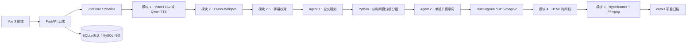

# 一键故事视频生成工作台：技术架构与实现总览

> 文档版本：2026-07-22  
> 项目目录：`G:\trae_voice_over_video`  
> 运行形态：Windows 便携整合包 + Git 源码部署双形态  
> 本文描述已落地实现；不把尚未开发的设想写成现有功能。

## 1. 产品定位

这是一个将文案、配音、字幕、分镜、生图与视频渲染串成一条流水线的本地 Web 应用。用户可以输入文案并选择本地或云端配音，最终得到横版故事/口播视频，以及便于二次编辑的音频、字幕、图片、提示词和页面资产。

一个项目同时覆盖三类创作模式：

| 模式 | 标识 | 典型用途 |
| --- | --- | --- |
| 都市惊悚 | `urban_suspense` | 鬼故事、都市悬疑、惊悚小说 |
| 口播科普 | `science_explainer` | 知识讲解、药学/科技口播、观点视频 |
| 通用自定义 | `general` | 神话、历史、情感、奇幻等自定义题材 |

它们复用同一条底层生产线；差异主要由默认画风、人物设定、Agent 指令和画面节奏控制。

## 2. 总体架构



关键原则：

- 前端负责输入、状态展示和编辑操作，业务编排在 Python 后端完成。
- 每个阶段都落盘中间产物，便于检查、断点续跑和单图重绘。
- Agent 上下文不是依赖某次在线聊天，而是写入项目文件并带指纹校验。
- 当前完整视频任务通过流水线锁串行运行，避免共享工作目录产物互相覆盖。

## 3. 技术栈与目录职责

| 层级 | 已用技术/组件 |
| --- | --- |
| 前端 | Vue 3、Vite、原生 CSS |
| 后端 | Python 3.10、FastAPI、Uvicorn、Pydantic |
| 数据库 | SQLite 默认；支持 MySQL / PyMySQL |
| 本地 TTS | 官方 IndexTTS2、PyTorch CUDA、FP16 |
| 云端 TTS | DashScope Qwen-TTS 非实时 API |
| ASR | Faster-Whisper、CTranslate2、VAD |
| Agent | Gemini 原生 API 或 OpenAI 兼容接口 |
| 生图 | RunningHub 标准模型 API / GPT-image-2 工作流 |
| 页面与渲染 | HTML/CSS/JavaScript、Hyperframes、Headless Chrome、FFmpeg |
| 便携运行时 | `runtime/python`、`runtime/node`、`tools/ffmpeg`、项目内模型与缓存 |

核心代码索引：

| 文件 | 职责 |
| --- | --- |
| `frontend/src/App.vue` | 主 UI、任务表单、参数/Agent 预设、画面修改器 |
| `frontend/src/api.js` | 前端 API 封装 |
| `backend/app/main.py` | FastAPI 路由、请求模型、参数预设、密钥保存 |
| `backend/app/pipeline.py` | JobStore 与完整流水线编排 |
| `module1_agent_director.py` | 断句、TTS 批处理、音频合并、原始字幕 |
| `module2_scene_director.py` | Faster-Whisper 识别 |
| `module2_5_text_corrector.py` | 原文/ASR 对齐与 SRT 校对 |
| `story_agents.py` | Agent 1、长文 Agent 1B、规划文件与指纹 |
| `module4_video_render.py` | Agent 2、生图、失败容错、HTML 页面 |
| `module5_video_render.py` | Hyperframes 视频渲染与 FFmpeg 合成 |
| `backend/app/visual_editor.py` | 图片重绘、替换、撤回与重渲染 |

## 4. 前端功能布局

### 4.1 顶部工作区与参数管理

顶栏提供：

- 生成工作台、待开发、模块 1·仅配音、模块 2·字幕识别四个页面入口；
- “保存当前参数”：按项目名保存当前 UI 参数；
- 已保存参数下拉框与“读取参数”；
- IndexTTS2 服务状态。

参数预设存放在：

```text
saved_parameters/{user_id}/{项目名}.json
```

保存范围为生成请求支持的参数，包括模式、TTS 引擎和参数、文本、画风/人物/环境、节奏、长文分段和 Agent 专家模式内容。真实 API Key 不写入参数预设。

本地上传参考音色保存的是服务器侧资产 ID。读取参数时，UI 会从上传资产记录恢复音色名称；浏览器出于安全原因不会把本机文件路径重新塞进原生文件选择控件，但不会影响仍存在的上传音色被实际调用。

### 4.2 生成工作台

主页面包含：

- 项目名称、TXT/Markdown 导入和手动文案输入；
- “已有配音和文案，不需要 IndexTTS2”路径；
- IndexTTS2 / Qwen-TTS 滑动切换；
- 长文自动拆分与每段最大字数；
- 单独的画面节奏控制；
- 模块 4 的画风、全局人物、故事世界与环境设定；
- 三种作品模式切换；
- 高级创作控制台（Agent 预设与专家模式）；
- 启动、停止、断点续跑、日志、产物和历史任务。

### 4.3 独立工具页

- **模块 1·仅配音**：只执行断句、TTS、WAV/SRT 输出。
- **模块 2·字幕识别**：上传音频，生成 SRT；可选上传文案比对校正，未上传时可用语言模型校正。
- **画面修改**：针对 `output` 中的历史项目编辑图片，支持分页浏览、查看完整提示词、重绘、替换本地图片、撤回、重置提示词和重新渲染。

## 5. 配音与字幕流水线

### 5.1 IndexTTS2 本地 GPU 路径

IndexTTS2 是默认的高质量路径，调用项目内官方模型与项目内 Python 运行环境。

流程：

1. 根据中文标点、换行与长度动态断句；
2. 合并过短句，避免 IndexTTS2 因极短文本而明显降质；
3. 按用户选择的并行数启动独立 worker；
4. 生成单句音频，按原文顺序合并；
5. 用真实音频时长生成原始 SRT；
6. 输出 `final_output.wav`、`final_output.srt` 等中间产物。

并行数限制在 1–3。显存不足时应优先降低并行数；不同显卡、参考音色和文本长度会显著影响显存需求。配音启动较慢时，日志会以低频心跳显示“已完成句数、并行数与已运行时间”，不转发模型的大量读条。

### 5.2 Qwen-TTS 云端路径

当用户没有足够的 NVIDIA GPU 时，可以切换至 Qwen-TTS。

- API Key 通过 UI 写入本机 `.env` 的 DashScope 配置；
- 支持官方系统音色下拉选择；
- 对支持指令控制的音色显示“配音描述”；
- 后端按 API 上限切分文案、下载各段音频并统一合并；
- 对不支持指令控制的音色，前端阻止携带配音描述提交，避免请求无效。

Qwen-TTS 是兼容路径，不替代 IndexTTS2。音色一致性与韵律通常更依赖于固定系统音色、统一指令和稳定的文本切分。

### 5.3 字幕识别与校对

模块 2 使用 Faster-Whisper 将音频转为带时间轴的识别结果。模块 2.5 用原文与识别文本做全局字符对齐：保留原文标点，并按可读长度切成短字幕，同时将时间连续映射回 SRT。

因此，后续分镜节奏的基准是**真实配音时间戳**，而不是纯字数。

## 6. 双 Agent 与画面节奏

### 6.1 Agent 1：全文理解和连续性规划

Agent 1 读取完整文案（长文会先建立全局总纲），输出严格 JSON 的“故事/知识圣经”，包括：

- 故事类型、主题、叙事语气；
- 角色外貌、关系、标志物；
- 分阶段服装/头饰/携带物 `wardrobe_states`；
- 地点视觉身份、时间与光线；
- 情节或知识节拍、线索、连续性和视觉安全规则；
- 对分段与画面节奏的建议。

超长文时，系统采用“Agent 1 全文总纲 + 必要时 Agent 1B 局部细化”的分层方式。规划文件带输入指纹；文案、模式、全局角色设定或 Agent 1 指令变化时不会错误复用旧规划。

### 6.2 Python 分组器：决定何时换画面

Agent 不直接决定最终换画频率。Python 分组器使用模块 2.5 的时间戳，并结合 UI 的节奏预设/自定义最短、目标、最长时长分组。

- 都市惊悚默认下限偏慢，避免高频闪切；
- 口播科普默认下限更长，避免像 PPT 翻页；
- Agent 1 的节奏建议只能在硬性时长边界内发挥作用；
- 每组会形成不可随意合并或遗漏的固定 `slide_id` 列表。

### 6.3 Agent 2：固定分组的镜头与提示词

Agent 2 接收固定 slide 分组、字幕上下文、Agent 1 规划、画风、人物和环境设定，输出：

```json
[
  {
    "includes_slides": ["slide_001", "slide_002"],
    "image_prompt": "中文单镜头生图提示词"
  }
]
```

它只为当前镜头描述主体、动作、环境、景别、机位、构图、光线与氛围；全局画风和完整角色资料作为上下文提供，不机械重复塞进每一条实际生图提示词。

设备、书信、照片、卷轴等承载关键信息时，规则要求生成物件正面特写或插入镜头，避免容易穿帮的第一视角/越肩透视。

## 7. 高级创作控制台与预设体系

基础模式面向普通用户：选择作品模式，填写画风、角色、世界环境即可运行。

启用“专家模式”后：

- 基础模块 4 的画风/人物/环境输入收起，防止双重指令冲突；
- 固定协议区为灰色只读：JSON 输出结构与“固定 slide 分组不得遗漏/合并”不能修改；
- Agent 2 可编辑创作指令开放；
- 导演题材为可清空、可替换的变量；
- Agent 1 默认折叠，标注为高危参数，供高级用户改写全文规划策略；
- 画面节奏保持独立可见，因为它不是 Agent 2 的编辑内容。

Agent 指令预设与参数预设是两套东西：

```text
saved_agent_prompts/defaults/       三个官方模式参考模板
saved_agent_prompts/{user_id}/      用户保存的 Agent DIY 模板
saved_parameters/{user_id}/         每次项目的完整 UI 参数
```

选择 Agent 模板会同时恢复其内容模式、Agent 1、Agent 2 和导演题材，作为可继续修改的起点；关闭专家模式时，这些 DIY 指令不参与生产请求。

## 8. 生图、失败保护与画面修改

### 8.1 在线生图

模块 4 调用 RunningHub/GPT-image-2 工作流，支持本地并发、多个 Key 轮换与任务队列控制。

常见可恢复问题（网络超时、服务端短暂失败、审核拦截、返回文件异常）不会直接终止整条视频：

- 当前图片自动重试；
- 审核相关错误会按安全策略改写当前提示词后重试；
- 必要时切换账户/等待队列；
- 单图持续失败时可复用邻近成功图，保证任务继续；
- 只有全局权限或算力都不可用等不可恢复情况才停止任务。

### 8.2 画面修改器

所有成功项目归档时都会保留可编辑数据至 `output/{项目名}/other`，因此历史任务不依赖临时 workspace 也可以进入画面修改。

画面修改器支持：

- 从 `output` 选择当前或历史项目；
- 每页 24 张图（4 列 × 6 行）按需加载；
- 单击图片放大预览；
- 编辑提示词并单图重绘；
- 并行提交多张重绘任务，卡片显示“重绘中”；
- 上传本地替换图、撤回图像、重置提示词；
- 图片完成后重新渲染字幕版、无字幕版或双版本；
- 重绘和重渲染进度写入主任务日志，并提供停止渲染。

## 9. 页面生成、渲染与输出

模块 4 将图片、音频、字幕和时间轴写入横版 HTML 页面；当某一时刻没有新图片时保持上一张画面，避免画面闪白。

模块 5 使用 Hyperframes/Headless Chrome 捕获页面，再由 FFmpeg 合成：

- `final_with_subtitles.mp4`：字幕版；
- `final_raw_presentation.mp4`：无字幕版；
- 支持 `VIDEO_RENDER_WORKERS=auto` 自动 worker 预算；
- 支持浏览器 GPU 与 NVENC/QSV/AMF 自动探测，失败时保守回退；
- 长文分段完成后使用 FFmpeg concat 拼接，减少重复编码。

完成后输出结构为：

```text
output/{项目名}/
├─ input/       文案、参考音频等输入资料
├─ image/       图片、提示词及映射
├─ video/       字幕版与无字幕版 MP4
└─ other/       SRT、规划 JSON、HTML、时间线和编辑器数据
```

产物区的按钮默认定位到文件资源管理器中的实际文件夹，不强制触发浏览器下载。

## 10. 任务状态、断点续跑和日志

`backend/app/pipeline.py` 中的 `JobStore` 负责任务、日志、进度、子进程和持久化。

- SQLite 默认保存在 `runtime_logs/app.sqlite3`；
- 服务重启后可以恢复历史记录；
- 停止任务会终止当前 Windows 子进程树；
- 断点续跑会复用已完成的音频、字幕、规划、图片和分段视频；
- 规划、图片映射和任务输入以指纹核验，避免将上次任务产物误用于新文案；
- 前端日志会压缩 TTS/渲染的高频刷屏输出，保留阶段、关键进度、重试与错误摘要。

## 11. API Key 与配置

UI 左侧登录区域支持：

- 通用 API Key；
- 语言模型 API Key；
- 图像模型 API Key；
- Qwen-TTS DashScope API Key。

当只填写通用 Key 而没有单独填写语言/图像 Key 时，后端按通用 Key 作为回退。密钥只写入本机 `.env`，不写入任务参数、预设文件、输出目录或 Git。

主要配置来自 `.env`，模板为 `.env.example`。相关分组包括 `AUTH_*`、`INDEXTTS2_*`、`ASR_*`、`GEMINI_*`、`RUNNINGHUB_*`、`VIDEO_RENDER_*`、`DASHSCOPE_*`、数据库与便携路径配置。

## 12. 便携化与部署边界

整合包将 Python、Node.js、FFmpeg、前端依赖、IndexTTS2 模型与必要缓存置于项目根目录内部，并由启动脚本按当前解压目录动态计算路径。

目标是“解压后，硬件与驱动满足条件即可运行”，不依赖固定盘符或预装 Python/Node/FFmpeg。仍由用户机器提供：

- Windows 系统；
- NVIDIA 驱动与 CUDA 可用环境（使用本地 IndexTTS2 时）；
- 网络与用户自己的 API Key（使用 Agent、生图或 Qwen-TTS 时）。

视频渲染的 Headless Chrome 必须随整合包准备；首次启动/热修时应通过本地运行时探测并修复，不能依赖用户目录中的浏览器缓存路径。

Git 源码版不提交：`.env`、虚拟环境/运行时、模型权重、`node_modules`、用户输入、生成图片/音频/视频、日志、缓存和数据库。它提供 `requirements.txt`、启动脚本与说明，让开发者按依赖完成部署。

## 13. 当前测试覆盖

截至本版，自动化测试共 34 项，覆盖：

- IndexTTS2 上传音色路径安全与模块 1 独立任务；
- Qwen-TTS 下载、指令音色适配；
- Agent 响应截断重试、全局规划复用与指纹失效；
- 长文分段、Agent 1B、人物服装状态规范化；
- 字幕重切分、时间连续性；
- Agent 2 上下文、角色展开、画风去重、节奏约束；
- 生图审核重写、单图失败降级与重试；
- 视频渲染 worker/GPU 加速配置；
- 任务日志降噪与分版本渲染进度。

建议在每次改动流水线或便携启动脚本后执行：

```powershell
.\runtime\python\python.exe -m unittest discover -s tests -v
cd frontend
npm run build
```

## 14. 已知边界与下一步方向

1. 完整视频任务目前是串行的；改为任务级独立工作目录后才适合多任务并发。
2. 字幕版和无字幕版仍需分别捕获渲染，可继续优化为一次画面渲染后用 FFmpeg 快速叠字幕。
3. Qwen-TTS 作为无显卡兼容方案，其长文稳定性、音色一致性仍弱于本地 IndexTTS2。
4. 高级 Agent DIY 已开放，但用户可以把模型输出格式改坏；因此固定协议保持不可编辑，Agent 1 仍标注高危。
5. 可继续演进：角色参考图/一致性控制、分镜人工审核、批量图片替换、背景音乐与音效、纵版输出、项目级时间线编辑和自动更新机制。

---

这份文档是当前发布前架构快照。后续修改配音、双 Agent、输出归档、便携化或渲染逻辑时，应同步更新对应章节。
