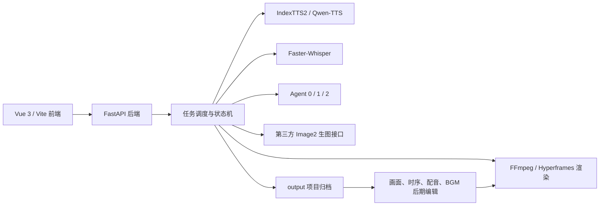

# One-Click VidGen 技术架构与实现总览

版本日期：2026-07-31

## 1. 产品定位

One-Click VidGen（中文界面名“一键成片”）是一套本地优先、可便携部署的 AI 叙事视频生产工作台。它把文案、配音、字幕、语义分镜、生图、渲染和后期返修改造成一条可以自动运行、分步审核、断点续跑的流水线。

当前主要面向：

- 都市惊悚、鬼故事、都市小说等叙事视频；
- 口播科普、知识分享和情感口播；
- 不依赖固定主持人的跨学科纯科普与教材级知识可视化；
- 用户自定义画风、人物和 Agent 指令的通用视频；
- 已有音视频的字幕识别、校对、烧录和 BGM 添加；
- 只运行本地或云端 TTS 的独立配音任务。

## 2. 总体架构



系统采用浏览器 UI + 本地 HTTP 服务的形式。前端只负责交互、素材上传、状态展示和预览；后端负责权限、持久化、进程控制、AI 请求、文件组织和故障恢复。模型、运行时和用户产物均可放在项目目录内，避免依赖固定的 C 盘用户路径。

## 3. 技术栈

| 层级 | 主要技术 | 职责 |
| --- | --- | --- |
| 前端 | Vue 3、Vite、原生 HTML5 Audio/Video | 工作台、参数、上传、日志、播放器、画面和时序编辑 |
| 后端 | Python、FastAPI、Uvicorn、Pydantic | API、登录、任务、文件、配置、进程生命周期 |
| 持久化 | SQLite 默认，保留 MySQL 配置能力 | 用户、会话、任务及必要元数据 |
| 本地配音 | 官方 IndexTTS2、PyTorch/CUDA | 参考音色克隆、并行句子合成 |
| 云端配音 | DashScope Qwen-TTS | 无高性能 GPU 时的替代配音 |
| 字幕 | Faster-Whisper、FFmpeg | ASR、精确时间戳、媒体抽取、字幕烧录 |
| 文本智能 | Gemini 或 OpenAI 兼容语言模型 | Agent 0/1/2、无原稿字幕校对 |
| 图像 | 第三方 Image2/RunningHub 兼容接口 | 文生图、参考图生图、多账号并行 |
| 视频 | FFmpeg 直出、Hyperframes 兼容路径 | 静态画面时间线、音频、字幕、BGM 合成 |

## 4. 核心目录和代码职责

### 前端

- `frontend/src/App.vue`：主工作台及全部业务 UI。
- `frontend/src/api.js`：对 FastAPI 的请求封装。
- `frontend/src/style.css`：响应式布局、状态、卡片与编辑器样式。

### 后端

- `backend/app/main.py`：HTTP API、请求模型、用户权限、参数预设、任务和编辑接口。
- `backend/app/pipeline.py`：任务状态机、主流水线、暂停/恢复/取消、长文分段、归档和渲染调度。
- `backend/app/visual_editor.py`：画面重绘、参考图、基线、时序、BGM 和后期重渲染。
- `backend/app/tts_editor.py`：按句试听与重配音，重建音频、SRT 和时间轴。
- `backend/app/semantic_timeline.py`：把 Agent 1 的语义单元映射为固定、连续且可渲染的画面组。
- `backend/app/gemini_client.py`：语言模型提供商和 OpenAI 兼容响应处理。
- `backend/app/indextts2_local.py`、`qwen_tts.py`：两种 TTS 适配层。
- `backend/app/diagnostics.py`：环境诊断和问题诊断包。

### 流水线脚本

- `module1_agent_director.py`：清洗、TTS 断句、配音、合并和初始字幕。
- `module2_scene_director.py`：Faster-Whisper 识别，重建真实语音时间戳。
- `module2_5_text_corrector.py`：原文与 ASR 字幕对齐校正。
- `story_agents.py`：Agent 0 全文资料和 Agent 1 时间轴规划、缓存与规范化。
- `module4_video_render.py`：固定分组、Agent 2、生图提示词组装和在线生图。
- `module5_video_render.py`：FFmpeg/Hyperframes 视频合成与字幕版本生成。
- `bgm_mixer.py`：BGM 列表循环、音量、切换和结尾渐弱。

### 启动与便携工具

- `start_windows.bat`：Windows 一键启动入口。
- `stop_dev.bat`：停止本地服务。
- `tools/portable_preflight.py`：手动环境检查。
- `tools/local_service_watchdog.py`：启动窗口关闭后的服务生命周期回收。

## 5. 三 Agent 与 Python 的边界

### Agent 0：全文资料管理员

Agent 0 读取校对后的全文；若用户提供原文，优先读取作者原文。它不依赖时间戳，输出稳定的全局资料：

- 故事类型、核心主题、叙事语气；
- 人物 ID、外貌、服装阶段、关系和标志物；
- 地点、时代、关键物件和屏幕信息对象；
- 线索与回收、连续性和视觉安全规则。

它解决“每个长文分段各自理解一次角色”造成的漂移。

### Agent 1：时间轴语义导演

Agent 1 读取完整字幕时间线和 Agent 0 资料，输出连续语义单元：

- 单元开始、结束的 slide ID；
- 事件目的、主体、动作、情绪和视觉焦点；
- hard/soft 边界和 hold/normal/fast 节奏；
- 当前单元角色和参考图绑定；
- 设备镜头模式及明确屏幕内容。

Agent 1 负责“哪些字幕属于同一件事”，而不直接写最终生图提示词。

### Python 分组器：确定性执行

Python 不理解故事，但能严格执行 Agent 1 的边界：

- 校验语义单元连续覆盖全部字幕且没有重叠、遗漏；
- 在语义边界内按时长目标合并或保持；
- 语义正确优先于最短停留时间；
- 只在超出硬性安全上限时做可控拆分；
- 生成 Agent 2 不可改变的固定 slide 分组。

### Agent 2：镜头提示词导演

Agent 2 接收固定分组、当前文本、Agent 0/1 摘要、用户画风、人物资料及参考图编号，为每个分组写一条 `image_prompt`。它不能遗漏、重复或自行重分组。

最终还有 Python 保护层负责：

- 去除重复角色描述和泛化身份；
- 注入当前镜头真正需要的人物硬约束；
- 绑定图1/图2/图3，但不把图片像素送给语言模型；
- 强制横版单画面和媒介风格；
- 根据设备三态规则决定人物交互或屏幕特写；
- 加入干净画质、禁用无意义多格和无关文字等底线。

### 语言模型规划硬门禁

语言模型是出图前的付费安全门。生产主流程要求 Agent 0、Agent 1、Agent 2 全部得到可解析且结构完整的 AI 结果：

- 未配置 Key、鉴权或余额异常、限流、HTTP 502/超时、空响应、JSON 错误和字段覆盖不完整均视为规划失败；
- 任一 Agent 失败都在 Image2 提交前抛出明确错误，不再静默进入 `local_fallback`；
- 失败时保留已完成的主配音、逐句音频、SRT 和时间线，修复接口后可断点续跑；
- 断点续跑只复用 `generation_source = gemini` 的当前版本 Agent 产物，旧本地降级缓存会被拒绝并重新规划；
- 本地 fallback 仍保留给测试和非生产独立调用，但主视频流水线强制开启硬门禁。

### 设备与信息载体约束

Agent 0 登记信息对象，Agent 1 标注 `none`、`device_interaction`、`screen_insert`，Python 再按每个固定画面组的实际字幕定位对应内容。明确内容时以手机、平板、显示器、报告、账单、书信或照片为主体；未明确内容时只表现人物使用设备并保持屏幕不可读。核心剧情事实以原文为准，但界面状态栏、列表、图标、色块、纸面版式、表格线和留白可自然设计，避免把防幻觉规则写成僵硬的视觉封锁。

## 6. TTS 与字幕架构

### IndexTTS2

文案先经过 Unicode、空白和段落清洗，再按语义标点拆句。分句器会合并过短片段、限制过长句，并把结尾引号等包裹符号保留在原句。随后按用户并行数调用官方 IndexTTS2，每句生成独立 WAV；临时文件监听器向 UI 汇报真实完成句数。所有句子最后统一音频参数、拼接，并生成一份按实际 WAV 时长计算的初始 SRT。

### Qwen-TTS

Qwen-TTS 使用 DashScope API，保留同一任务的音色、指令和主要参数；下载结果会转为流水线统一的 WAV 格式，并进行必要的响度处理。它是本地显卡不足时的下位替代，不改变后续 ASR、Agent 和渲染逻辑。

### Faster-Whisper 和模块 2.5

无论哪种 TTS，最终配音都会再次进入 Faster-Whisper。这样字幕时间戳以真实语音为准，而不是依赖字符数估算。模块 2.5 再把识别字幕和原始文案对齐，修复错字、漏字和标点，同时保留 ASR 时间轴。

使用“已有配音和文案”时跳过 TTS，但仍从 ASR 开始，因此后续 Agent 仍能获得时间戳；只有完全无文案时，Agent 0 才改为读取校正后的 ASR 全文。

## 7. 长文处理

- UI 单次正文限制为 12,000 字符左右，避免超出模型上下文和产生过长成片。
- 3,000 字是渲染分段目标上限，不是生硬切断位置。
- Agent 0 和 Agent 1 优先通读全文，再由后端根据 Agent 1 事件边界组合长文分段。
- 每段独立生成画面资产，最终按顺序拼接；全局人物、地点和线索资料贯穿所有段。
- 超大单一语义单元无法放入安全上限时，才在已有字幕边界内拆分，并标记为软切口。

## 8. 渲染与 BGM

默认渲染优先使用 FFmpeg 静态画面直出：读取海报映射和字幕时间线，按画面存在区间生成滤镜图，叠加主配音并编码纯净版。字幕版再基于纯净版烧录 SRT，避免重复生成画面帧。Hyperframes 保留为兼容路径。

BGM 由独立混音层完成：

- 按列表顺序播放，播完从第一首继续循环；
- 每首可设置 dB 音量；
- 可在切换和最终结尾添加渐弱；
- 主配音保持独立，不因 BGM 列表变化而重新跑 TTS；
- 后期在画面修改区添加或替换 BGM 后可直接重渲染。

## 9. 输出归档与可恢复性

标准项目输出：

```text
output/项目名称/
├─ input/          原始文案、配音、参考素材和已归档 BGM
├─ image/          当前确认使用的全部画面
├─ video/          字幕版、纯净版及后期重渲染成片
└─ other/          SRT、HTML、画面映射、时间线、Agent 结果、清单与编辑状态
```

输出使用临时目录构建，必要文件校验通过后再原子式落盘。`other/归档清单.json` 是后期编辑入口。只有确认归档完整后，临时 workspace 才允许清理。画面修改、画面时序、配音精修和 BGM 重渲染均以 output 为事实来源。

仅配音任务使用根目录下独立的 `TTS_Output`，字幕独立任务使用 `output/字幕任务ID`。

## 10. 任务状态和容错

任务对象保存状态、步骤、进度、请求参数、日志、产物和取消标记。主要状态包括 queued、running、waiting_confirmation、completed、failed、cancelled。

容错机制包括：

- 网络、审核和服务端失败的单图重试；
- 图像 API 多账号池和失败账号暂时隔离；
- 断点续跑只补缺失资产，避免重复规划整批图片；
- TTS 安全停止和进程树回收；
- 重绘与重渲染独立任务，不阻塞主流水线历史结果；
- 诊断包导出环境、请求摘要和脱敏日志；
- 旧后台探测和启动窗口 watchdog。
- 语言模型规划失败的出图前熔断，防止空人物表、原文兜底提示词继续消耗 Image2 额度。

## 11. 安全与隐私边界

- `.env`、API Key、用户输入、日志、音频、图片、视频和模型权重不进入 Git。
- API Key 保存在本机配置中，前端只显示配置状态，不回显完整密钥。
- 诊断包应脱敏，不打包模型权重和用户密钥。
- 第三方模型与接口受其服务条款、审核和计费规则约束。
- IndexTTS2、Faster-Whisper、FFmpeg、前端依赖等仍应保留其原始许可证和版权声明，项目不应宣传为“所有底层技术纯自研”。

## 12. 当前质量基线与限制

- 2026-07-31 自动化测试共 119 项通过。
- 4090 可使用 IndexTTS2 并行 2 作为常用档；不同显存、参考音频和句长可能需要降为 1。
- 图像一致性已经有角色卡、状态约束和参考图保护，但生成式模型仍无法做到绝对一致。
- 超时、审核、余额、网络、模型升级和第三方接口变更属于外部不稳定因素。
- 便携包体积较大，模型和 CUDA 环境不适合直接放普通 Git 历史；应通过 Release、网盘或对象存储分发，并在 Git 中保留安装说明与校验信息。
