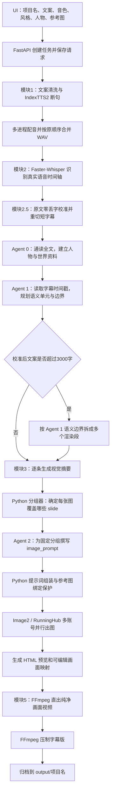

# 一键成片 / One-Click VidGen：默认模式完整技术路线

> 更新日期：2026-07-26  
> 说明：本文只描述当前代码实际执行的默认“一键生成视频”流程。默认条件为：都市惊悚模式、官方 IndexTTS2、本地 GPU、在线 Image2/RunningHub 出图、非分步模式、自动长文分段、同时生成字幕版和无字幕版。Qwen-TTS、已有配音、字幕独立模块、画面修改等属于旁路功能，文末单独说明。

## 1. 一句话理解整个系统

系统先把用户文案变成一条完整配音，再用 Whisper 重新获得真实语音时间轴；Agent 0 理解全文，Agent 1 根据校准后的字幕时间轴规划语义边界，Python 按这些边界和时长规则确定“一张图覆盖哪几句字幕”，Agent 2 为每个固定画面组撰写生图提示词，Image2 生成图片，最后 FFmpeg 按字幕时间把图片、音频和字幕合成为视频。



## 2. UI提交的核心参数

默认主工作台由 Vue 前端收集参数，通过 `POST /api/jobs` 提交给 FastAPI 后端。主要参数如下。

| 类型 | 默认值 | 作用 |
|---|---:|---|
| 内容模式 | 都市惊悚 | 决定默认画风、Agent提示词和画面节奏 |
| TTS引擎 | IndexTTS2 | 使用本地GPU进行音色克隆配音 |
| 参考音色 | 用户选择或上传 | 作为 IndexTTS2 的音色参考音频 |
| 语速 / 音量 / 音调 | 1 / 1 / 0 | 配音生成后的统一音频控制 |
| TTS并行数 | 2 | 同时启动的 IndexTTS2 推理进程数 |
| 画面节奏 | 按作品风格自动 | 默认最低6秒、目标8秒、最长12秒 |
| 每张图最多字幕片段 | 6 | Python画面分组器的保护上限 |
| 长文自动分段 | 开启 | 超过阈值后按语义边界分段渲染 |
| 每段最大字数 | 3000 | 长文渲染段的目标上限 |
| 成片版本 | 双版本 | 生成字幕版和无字幕版 |
| 分步模式 | 关闭 | 默认从配音连续运行到最终成片 |

前后端同时限制单次文案最多12000个字符。这里的12000是整个任务的输入上限，3000只是长文“渲染分段”的目标上限，两者不是一回事。

## 3. 任务建立与运行环境

### 3.1 前端

- Vue 单页应用收集用户参数。
- API Key、音色上传ID、角色参考图ID等随任务请求发送。
- 前端轮询任务状态和日志，并把后端进度显示在主日志区。

### 3.2 后端

- FastAPI 接收任务并生成一个随机任务ID。
- 任务请求、状态、进度、日志和产物索引写入 `runtime_logs/app.sqlite3`。
- 原始文案同时保存到：
  - `workspace/jobs/<任务ID>/script.txt`
  - `workspace/1_original_text.txt`
- 正常新任务开始前会清理共享 `workspace` 中上一轮的临时产物；每个任务的重要文件会另外复制进自己的 `workspace/jobs/<任务ID>/artifacts`。

## 4. 模块1：IndexTTS2 配音

执行文件：`module1_agent_director.py`

### 4.1 文案清洗

程序先完成以下处理：

- 删除包含“此处留白”的制作备注行；
- 删除 `【……】` 形式的制作指令；
- 合并重复空行；
- 保留普通括号里的口播内容。

### 4.2 当前TTS断句规则

IndexTTS2目前沿用口播版动态断句逻辑：

- 目标最短15字符；
- 目标最长50字符；
- 在中文句号、逗号、问号、感叹号和换行后形成候选片段；
- 候选片段不断合并，直到再加入一段会超过50字符；
- 低于15字符的短片段优先与下一段合并；
- 没有批次数量上限。

需要注意：50字符目前不是绝对硬上限。单个没有合适标点的长句可能超过50字符；短句与下一段合并时也可能跨越两个完整句子。这是后续准备优化的区域。

### 4.3 多进程推理

- 根据UI设置启动1至3个IndexTTS2工作进程；默认2个。
- 小句按序号轮流分配给各工作进程，例如进程1处理1、3、5句，进程2处理2、4、6句。
- 每个进程独立加载官方 IndexTTS2 并使用同一参考音色。
- 后端监视临时WAV文件是否稳定落盘，实时显示真实完成句数；不依赖CLI缓冲日志。
- 即使各句完成顺序不同，最后也严格按原文序号重新排列。

### 4.4 音频合并与原始字幕

- 每句生成独立WAV。
- 对每句应用统一语速、音量和音调控制。
- 读取每个WAV的真实时长。
- 按顺序直接拼接为 `workspace/2_audio_srt/final_output.wav`。
- 根据每句真实时长生成模块1原始字幕 `final_output.srt`。

模块1的TTS小句只服务于配音稳定性，不直接决定最终字幕长度，也不直接决定一张画面覆盖几句话。

## 5. 模块2：基于真实音频重建字幕时间轴

执行文件：`module2_scene_director.py`

配音合并后，系统不会直接把模块1的句子当成最终字幕，而是重新分析完整音频：

- 使用本地 Faster-Whisper Base 模型；
- 默认使用 CUDA / FP16；
- 使用VAD识别真实语音区间；
- 检测语种和置信度；
- 对不超过约0.35秒的微小语音空档进行连续性填补；
- 输出短字幕 `workspace/2_audio_srt/final_short.srt`；
- 输出带真实时间戳的 `workspace/3_visual_template/scene_timeline.json`。

这一层解决的是“实际声音什么时候说了什么”。所以即使TTS某句话语速变快、变慢或停顿不同，后续画面仍以真实音频时间轴为准。

## 6. 模块2.5：原文对齐与字幕零丢字校准

执行文件：`module2_5_text_corrector.py`

Whisper可能出现错别字、同音字或漏字，因此模块2.5同时读取：

- 用户原始文案；
- Whisper识别出的全部字幕；
- 每条字幕的开始和结束时间。

当前校准流程是：

1. 清除标点后，对ASR全文与原文进行全局字符对齐；
2. 把所有ASR字幕边界映射到原文中的连续边界；
3. ASR整段漏读的原文自动分配给相邻字幕，不允许出现无人接收的文字；
4. 强制保证所有字幕首尾连续、无重叠、无遗漏；
5. 校准结果重新按标点和屏幕可读长度切分，每条最多约24字符；
6. 根据字符权重在原字幕时间区间内分配新时间；
7. 最后验证“全部校准字幕拼接结果”是否100%覆盖原始文案；不一致则直接报错，不再静默丢字。

产物仍写回：

- `final_short.srt`
- `scene_timeline.json`

从此以后，Agent和画面分组读取的都是模块2.5校准后的字幕及时间戳。

## 7. Agent 0：全文资料导演

主要实现：`story_agents.py`

Agent 0只读全文，不需要字幕时间戳。它负责建立全局故事资料：

- 故事类型、主题、叙事语气和一句话梗概；
- 角色姓名、身份、外貌、服装、标志物和关系；
- 地点、时代、世界观和环境规则；
- 线索、伏笔与回收关系；
- 角色连续性与视觉安全规则；
- 用户填写的全局人物设定和时代环境设定。

输出文件：`story_context.json`。

Agent 0的任务是“理解全文并建立资料库”，它不决定哪几句共用一张图，也不写最终Image2提示词。

## 8. Agent 1：带时间轴的全文分镜导演

Agent 1读取：

- Agent 0的全文资料；
- 模块2.5校准后的全部字幕；
- 每条字幕的 `slide_id`、开始时间、结束时间和正文。

它负责输出：

- 全文故事节拍 `story_beats`；
- 连续语义单元 `semantic_units`；
- 每个语义单元的起止slide；
- 单元结束后是硬边界还是软边界；
- 画面节奏建议；
- 角色不同阶段的服装状态范围；
- 人物、地点、线索和连续性规则。

输出文件：`story_plan.json`。

Agent 1负责判断“哪些字幕在语义上属于同一件事”，但它仍不直接生成图片。Python会验证它输出的slide是否连续、完整、没有重复和遗漏。

## 9. 3000字长文分支

长文分割发生在TTS、ASR、字幕校准、Agent 0和Agent 1之后。因此超过3000字不会把全文提前拆碎给Agent阅读。

### 9.1 不超过3000字

- 全文作为一个视频段；
- Agent 0和Agent 1各执行一次；
- 全文连续进入模块3、模块4和模块5。

### 9.2 超过3000字

系统优先使用Agent 1的全文 `semantic_units` 进行打包：

1. 依次累加完整语义单元；
2. 再加入下一个单元会超过3000字时，结束当前渲染段；
3. 不主动从语义单元中间截断；
4. 如果单个语义单元自身已经超过3000字，才回退到字幕边界按字数切分；
5. Agent 1边界不可用时，尝试调用语言模型按主题分段；
6. 语言模型分段也不可用时，最后回退为纯字幕字数分段。

每个渲染段会：

- 把时间戳归零；
- 从完整配音中精确截取对应音频；
- 写出本段SRT；
- 投影全文Agent 1资料到本段；
- 独立执行模块3、模块4和模块5；
- 把分段图片、映射和视频复制到任务专属 `artifacts/parts`。

全部分段完成后，FFmpeg使用流复制方式按顺序拼接视频，并恢复完整音频、完整字幕和完整时间轴。

### 9.3 当前长文层级规划的真实状态

代码中已经存在Agent 1B“局部分段策划器”，也会在超过约6000字时显示“全文总纲 + 分段细化”的日志；但当前主流水线实际上只把全文Agent 1规划投影到各段，还没有真正调用Agent 1B重新细化每一段。这是目前明确存在、可继续完善的技术债。

## 10. 模块3：逐字幕视觉摘要

主要实现：`backend/app/semantic_timeline.py`

Agent 1完成后，模块3读取校准字幕并生成 `fine_grained_timeline.json`：

- 保留每条字幕的slide、正文和时间戳；
- 为每条字幕补充 `visual_summary`；
- Gemini可用时，根据Agent 1提供的人物、地点、连续性和语义单元重写视觉摘要；
- Gemini失败时使用本地正文摘要，不中断任务。

模块3只为每条字幕提供视觉素材说明，不负责最终的“一张图覆盖哪些slide”。

当前模块3的系统提示词仍写死为“鬼故事与都市小说视频导演”，虽然它会继承不同模式的上下文，但对口播科普和完全自定义模式并不够干净，属于另一个待整理点。

## 11. Python画面分组器

主要实现：`module4_video_render.py` 中的 `_visual_groups`。

它读取：

- Agent 1的语义单元和边界；
- 每条字幕真实开始、结束时间；
- 用户选择的最低、目标、最长画面时长；
- 每张图最多字幕片段数；
- Agent 1建议的 `hold / normal / fast` 节奏。

分组原则：

- 语义正确优先于最低停留时长；
- Agent 1硬边界不能为了凑6秒而跨越；
- 软边界允许在语义合理时合并；
- 目标时长用于控制正常节奏；
- 最长时长和最多slide数是安全上限；
- 所有slide必须连续覆盖一次，不能遗漏、重复或乱序。

这一阶段完成后，“哪几条字幕对应哪张图片”已经被Python固定。Agent 2不能再合并、拆分或调整这些分组。

## 12. Agent 2：按固定分组撰写生图提示词

Agent 2收到：

- 固定的slide分组；
- 每组字幕正文、时间戳和模块3视觉摘要；
- Agent 0/1的全文人物、地点和连续性资料；
- 用户的画风提示词；
- 用户全局人物设定；
- 用户时代与环境设定；
- 图1、图2、图3的角色绑定文字。

Agent 2不会读取用户上传图片的像素内容。它只知道“艾德里安对应图1、伊芙琳对应图2”等编号关系，因此不会因为图片识别增加语言模型Token。

Agent 2对每个固定分组输出：

- `includes_slides`
- `image_prompt`
- `reference_image_ids`

长任务会按固定画面组分批调用Agent 2；当前每批大约容纳28个字幕片段，但每批继承同一份全文上下文。

## 13. Python最终提示词组装与保护

Agent 2输出后，Python继续做确定性处理：

1. 验证每组slide与固定分组完全一致；
2. 将角色姓名展开为稳定的“身份＋姓名＋外貌＋参考图编号”；
3. 使用幂等去重，防止出现“王国骑士王国骑士”或重复参考图括号；
4. 根据当前slide范围加入正确服装阶段；
5. 加入当前模式的统一画风；
6. 移除“同一角色在所有画面保持一致”这类单张图模型无法执行的跨图元指令；
7. 检测提示词中的“角色形象参考图N”，自动补齐遗漏的 `reference_image_ids`；
8. 对手机、信件、照片等重要物件采用正面特写；
9. 检测多时刻、多格、分屏和拼贴风险，优先收束为单场景单机位；
10. 改写容易触发审核的露骨内容；
11. 统一追加干净画质要求。

最终映射保存为：

- `poster_mapping.json`
- `visual_prompt_plan.json`

第二个文件包含版本号和指纹，用于判断断点续跑时能否安全复用旧提示词。

## 14. Image2 / RunningHub 出图

### 14.1 参考图

- 没有上传参考图：使用纯文生图接口。
- 上传了参考图，但当前镜头没有相应角色：仍使用纯文生图。
- 当前镜头出现绑定角色：切换到图生图接口。
- 为保持图1、图2、图3编号稳定，只要当前镜头使用了任一主任务参考图，就按原顺序携带完整参考图目录，避免“图3因单独上传而变成模型眼中的第一张图”。

### 14.2 多账号与并发

- API Key从 `.env` 中的主Key和账号池读取；
- 主流程使用共享账号池轮询分配任务；
- 本地工作线程并发提交；
- 421队列满时优先切换其他账号；
- 414算力不足时停用该账号并换号；
- 1014权限拒绝时停用该账号并换号；
- 网络超时、服务端异常和返图异常只重试当前图片；
- 审核失败时自动安全改写当前提示词后重试；
- 极端情况下单图多次失败，可复用最近成功邻图以保证整条任务不停止，并在日志中明确记录。

每张生成图片和对应提示词写入：

- `workspace/3_visual_template/assets/*.jpg`
- 同名 `.txt` 提示词文件

## 15. HTML页面与画面时间轴

模块4同时生成 `index.html`。HTML包含：

- 图片文件路径；
- 每张图开始和结束时间；
- 0.8秒左右的画面淡入过渡；
- 音频路径；
- 字幕注入槽；
- 当前字幕查找与显示逻辑。

HTML目前主要承担可检查预览、历史兼容和后期编辑数据载体。默认最终成片已经不再依赖浏览器逐帧截图。

## 16. 模块5：FFmpeg合成视频

执行文件：`module5_video_render.py`

默认渲染引擎是FFmpeg直出：

1. 读取 `poster_mapping.json` 和 `fine_grained_timeline.json`；
2. 找到每张图对应的准确时间范围；
3. 按1920×1080、30fps组织静态画面；
4. 图片区域顶部保留5%，底部保留10%；
5. 使用淡入淡出方式连接相邻画面；
6. 加入完整配音；
7. 优先使用 NVIDIA NVENC 编码；
8. NVENC不可用时自动回退软件x264。

双版本模式下不会把全部画面渲染两遍：

- 先生成一次纯净版画面视频；
- 再复用纯净版，通过FFmpeg/libass压制字幕版；
- 字幕默认是白色粗体、深蓝色底卡、底部居中；
- 字幕版NVENC失败时自动回退x264。

只有FFmpeg直出无法使用时，才回退到Hyperframes＋便携Chrome兼容渲染路径。

## 17. 最终归档

任务成功后统一整理到：

```text
output/项目名称/
├─ input/
│  ├─ 文案.txt
│  └─ 配音.wav
├─ image/
│  ├─ poster_001_*.jpg
│  ├─ poster_001_*.txt
│  └─ ...
├─ video/
│  ├─ 最终视频_字幕版.mp4
│  └─ 最终视频_纯净版.mp4
└─ other/
   ├─ 最终字幕.srt
   ├─ 最终画面.html
   ├─ 画面映射.json
   ├─ 画面时间线.json
   ├─ 画面修改清单.json
   ├─ 参考图清单.json
   └─ reference_images/
      ├─ main_01.*
      ├─ main_02.*
      └─ main_03.*
```

该目录被设计为自包含项目包。即使以后清理 `workspace/jobs`，画面修改、重绘、时序调整和重新渲染仍应只依赖 `output` 内的数据。

## 18. 断点续跑与失败保护

### 18.1 断点续跑

根据现有产物判断可以复用的阶段：

- 有完整配音：跳过模块1；
- 有字幕时间轴：跳过模块2和2.5；
- Agent计划指纹和版本一致：复用Agent计划；
- Image2图片及提示词指纹一致：复用已经成功的图片；
- 画面检查完成：可以只运行模块5重新渲染。

### 18.2 安全指纹

Agent和画面计划保存：

- 原文指纹；
- 字幕场景指纹；
- Agent版本；
- 角色连续性版本；
- 提示词计划版本。

只要文案、字幕、角色规则或提示词算法发生关键变化，旧缓存就会失效，避免把上一版图片错误套到新任务。

### 18.3 停止任务

- 后端为每个任务保存取消状态；
- 长循环、子进程和阶段切换前都会检查取消状态；
- 重绘和重新渲染另有独立停止接口。

## 19. 默认主流程以外的旁路

### Qwen-TTS

- 替代模块1的本地IndexTTS2；
- 使用云端固定音色与配音描述；
- 目前按UTF-8字节数控制每段约240至540字节；
- 为减少音色和语气漂移，当前固定单并发顺序调用；
- 下载后统一转为单声道24kHz WAV并做响度归一化；
- 后续模块2至模块5与IndexTTS2完全共用。

### 已有配音和文案

- 跳过模块1；
- 上传音频被转换/复制为 `final_output.wav`；
- 从模块2重新识别真实时间轴；
- 后续流程不变。

### 没有参考文案

- 模块2先完成纯语音ASR；
- 模块2.5无法做原文物理对齐时，可使用语言模型校对ASR错别字和标点；
- Agent 0读取校对后的ASR全文。

### 分步模式

- 模块1完成后暂停，允许试听和重新配音；
- 用户确认后继续字幕、Agent和出图；
- 图片完成后再次暂停；
- 用户确认或修改图片后，只运行模块5渲染。

## 20. 四条核心数据链

理解整个系统时，可以始终盯住下面四条数据链。

### 文本链

```text
用户文案 → TTS小句 → ASR文本 → 模块2.5校准字幕 → Agent语义资料 → Agent 2画面提示词
```

### 音频链

```text
参考音色 → 各句WAV → 完整配音WAV → Whisper时间轴 → FFmpeg视频音轨
```

### 时间链

```text
每句真实WAV时长 → Whisper字幕时间 → 校准短字幕时间 → 画面起止时间 → 视频帧时间
```

### 画面链

```text
Agent 1语义单元 → Python固定画面组 → Agent 2提示词 → Python组装保护 → Image2图片 → FFmpeg成片
```

## 21. 当前最值得继续优化的三个位置

1. **TTS语义断句**：当前仍是15至50字符的早期口播规则，句号与逗号权重接近，容易跨完整句合并。
2. **真正接入Agent 1B**：超6000字时应让每个长文段在全文资料约束下做一次局部细化，而不是只投影全文边界。
3. **模块3模式解耦**：视觉摘要提示词不应始终写死为鬼故事导演，应随都市惊悚、口播科普和通用模式切换。

这三个点分别对应配音自然度、超长文结构上限和多题材泛化能力。
