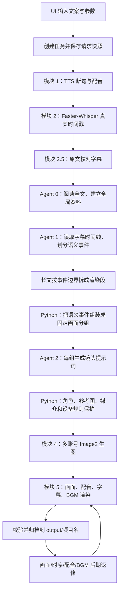

# One-Click VidGen 默认模式完整技术路线

版本日期：2026-07-31

本文描述从用户输入文案、选择配音音源，到最终输出视频和进入后期返修的完整执行顺序。默认示例为：都市惊悚模式、本地 IndexTTS2、非分步模式、双版本成片。

## 1. 一图看懂主流程



## 2. 启动、登录和运行环境

1. 用户双击 `start_windows.bat`。
2. 启动脚本检查项目内的 Python、Node、FFmpeg、浏览器等路径，识别是否存在旧服务。
3. 若旧服务不是本次启动的实例，会先安全结束，再启动 FastAPI 和前端。
4. 浏览器打开工作台；watchdog 记录启动窗口心跳，窗口正常关闭后回收本次前后端。
5. 用户可主动点击左侧“运行环境检测”，检查 TTS、CUDA、模型、ASR、FFmpeg、浏览器和 API 配置。该检查不是每个任务强制执行。

## 3. UI 请求参数收集

主界面收集并提交：

- 项目名称；
- 上传文案或直接粘贴的正文；
- 是否已有配音和文案、是否跳过 TTS；
- TTS 引擎、参考音色、情绪、语速、音量、音调和并行数；
- 作品模式、画面节奏、统一画风、人物、世界背景；
- 作品模式包括都市惊悚、口播科普、纯科普、通用自定义及专家预设；纯科普默认不建立主持人物；
- 最多三张角色/形象参考图及其图1至图3编号；
- Agent 预设或专家模式的 Agent 0/1/2 指令；
- 长文分段开关和目标字数；
- BGM 列表、音量、顺序和渐弱；
- 成片版本：纯净版、字幕版或双版本；
- 是否启用分步模式。

前端调用 `POST /api/jobs` 创建任务。后端会规范化项目名、校验正文长度（约 12,000 字符上限）、检查用户权限，保存完整请求快照，并把任务放入后台执行队列。

## 4. 输入准备

后端为任务建立隔离目录，并把上传素材复制到受控位置。直接粘贴的正文会落为任务文案文件，避免刷新后丢失。参考图只存路径、序号和绑定信息；语言 Agent 不读取图像二进制。

如果用户选择已有配音：

- 上传音频被转换为流水线标准格式；
- 跳过模块 1；
- 若有原稿，原稿仍用于 Agent 0 和模块 2.5；
- 若无原稿，后续使用 ASR 文本作为正文来源。

## 5. 模块 1：TTS 断句和配音

### 5.1 文本清洗

统一换行、空白、异常 Unicode 和段落边界，保留会影响语气的常规标点。

### 5.2 动态断句

分句器按以下优先级工作：

1. 段落和明确句末标点；
2. 逗号、分号等自然从句边界；
3. 最短长度合并，避免 IndexTTS2 因文本过短失真；
4. 最大长度保护，避免单句过长导致耗时和显存峰值；
5. 无自然边界时才做安全硬切。

`“”、《》、<>、【】` 等包裹符号随所属语句保留，本身不构成独立切句条件。

### 5.3 合成

本地模式按用户并行数调用官方 IndexTTS2。每个句子生成一个独立 WAV，后台监听临时目录，把真实生成数显示为 `已完成 n/总数`。首次模型加载、参考音频特征提取等阶段会显示准备状态。

云端模式逐句调用 Qwen-TTS，固定本任务的音色、配音描述和参数，下载并规范化音频。

### 5.4 初步拼接

每个 WAV 经统一采样率、声道和必要的音频控制后，按原句顺序拼接为 `final_output.wav`。根据每句实际 WAV 时长生成初始字幕和 TTS 片段清单，供后面的配音精修使用。

分步模式会在这里进入“配音确认”状态。用户可试听、下载、重新配音，确认后继续。

## 6. 模块 2：真实字幕时间戳

完整配音进入 Faster-Whisper，重新识别语音并生成短字幕。这样后续使用的时间戳来自真实发音，而不是 TTS 分句字数估算。

输出包含字幕开始/结束时间、识别文本和 slide ID。slide ID 是后续 Agent、分组、画面、时序编辑的基础主键。

## 7. 模块 2.5：文本校正

系统将 ASR 字幕与原始文案对齐：

- 时间戳保持来自 ASR；
- 字词、专有名词和标点尽量恢复为作者原文；
- 保证全部字幕连续、有序；
- 生成校正后的 `scene_timeline.json` 和最终 SRT。

如果用户跳过校正，则把 ASR 字幕直接写入后续时间线。独立字幕任务没有原文但选择校正时，可调用语言模型做上下文校正。

## 8. Agent 0：建立全文资料

Agent 0 在模块 2.5 后运行，但它优先读取用户原始正文，不依赖时间戳。没有原文时，读取校正后的 ASR 全文。

它输出 `story_context.json`，主要内容包括：

- 故事概述、主题、类型和叙事气质；
- 稳定人物 ID、角色身份、外貌、阶段服装和关系；
- 地点、时代、常见环境；
- 关键物件、信件、照片和设备屏幕信息；
- 线索、回收、连续性和安全规则。

该结果是所有长文片段共享的全局资料。

生产流水线要求该文件的 `generation_source` 为 `gemini`。语言模型未配置、超时、限流、返回空内容或无法形成有效全文资料时，任务在出图前停止，不写入本地兜底资料冒充成功结果。已经完成的配音和字幕会保留。

## 9. Agent 1：全文时间轴语义规划

Agent 1 接收 Agent 0 资料和带时间戳的完整字幕。它不再被动接受 Python 先切好的画面，而是先判断：

- 哪些连续字幕在讲同一个动作、场景或观点；
- 何处是必须换画面的 hard 边界；
- 何处是可以合并或拆分的 soft 边界；
- 当前事件适合 hold、normal 还是 fast；
- 当前事件是否有人物、哪些角色参与；
- 是否涉及设备，以及是人物操作还是明确屏幕内容。

Agent 1 输出必须覆盖全部 slide ID，不能重叠或遗漏。后端会规范化、校验；解析失败、覆盖不完整或读取到旧 `local_fallback` 缓存时，生产任务不会继续进入模块 4。修复语言接口后可复用此前已经完成的配音和字幕重新规划。

## 10. 长文分段

长文不会先按 3,000 字硬切再让 Agent 理解。正确顺序是：

1. Agent 0、Agent 1 尽可能阅读全文；
2. 后端把 Agent 1 的完整语义事件作为不可随意破坏的分区；
3. 动态规划在不超过目标上限的前提下，组合成尽量均衡的渲染段；
4. 优先选择 hard 边界，避免生成特别短的尾段；
5. 只有单个事件本身超过安全上限时，才在字幕边界内拆开。

每个分段会拥有局部 slide ID，但保留与全文的映射；最终拼接和编辑归档使用全局唯一标识，防止长文画面错位。

## 11. Python 固定画面分组

`semantic_timeline.py` 将 Agent 1 的语义单元变为确定性画面组。主要控制量为作品节奏预设、目标停留时长、最短停留时长、事件边界和字幕实际时长。

关键规则：

- 不跨 hard 边界合并；
- 同一完整事件即使略短，也可以独立成图；
- 同一事件内部可根据时长和 visual pacing 产生一张或少量画面；
- 不为凑最短时长把后一个话题拉进前一张图；
- 输出固定 `includes_slides` 分组，Agent 2 无权更改。

## 12. Agent 2 与最终提示词装配

Agent 2 为每个固定组生成当前镜头独有的主体、动作、场景、景别、机位、构图、光线和氛围。它只返回严格 JSON。

之后 Python 装配器加入三层信息：

1. 统一画风和媒介；
2. 当前镜头真正出现的角色硬约束及参考图编号；
3. Agent 2 的镜头特有描述和底线画质规则。

装配器会去重人物资料，不把“所有角色资料”机械塞入每张图；画面没有该角色时，全局人物段不参与本镜头。对于参考图，发送给 Image2 的提示词会写明“男主形象参考图1”等，实际图片文件也按相同顺序上传。

设备镜头使用三态保护：

- `none`：普通镜头；
- `device_interaction`：只表现人物使用手机、平板或电脑，屏幕不可读；
- `screen_insert`：只在正文明确给出消息、照片、书信或屏幕信息时，生成设备/载体内容特写，通常不混入人物脸部特写。

当一个较长 Agent 1 单元包含多件证据时，Python 会根据每个固定画面组自身字幕重新定位信息对象，避免同一手机内容、报告或账单被复制到所有子画面。界面布局与纸面版式允许合理发挥；人物关系、金额、日期、结论等会改变剧情的信息以原文为准。

## 13. 模块 4：图像生成

模块 4 把每条最终提示词发送给 Image2 接口。多个图像 API Key 构成账号池：

- 可并行提交多个画面；
- 余额不足、鉴权失败或明显不可用的账号会被暂时隔离；
- 网络超时、审核、服务端失败按策略重试当前图；
- 单图失败不会立即让整个长任务停摆；
- 已成功图片和提示词写入检查点，断点续跑只补缺失项。

在任何图片提交之前，Agent 2 必须完成全部提示词批次。任一批次发生服务端超时、鉴权/限流、返回截断、JSON 解析或固定分组覆盖错误时，整次出图阶段立即终止，不用本地模板拼接原文，也不提交已经规划好的其他批次，从而避免无效图像费用。

图片、提示词、对应字幕、分组和引用关系共同生成 `poster_mapping.json`。

分步模式会在全部画面完成后暂停，用户可以打开预览目录或进入画面修改，确认后再渲染。

## 14. 模块 5：视频渲染

### 14.1 纯净版

后端读取图片、画面映射和字幕时间戳，用 FFmpeg 为每张静态画面建立准确持续时间，拼成视频流，再与主配音合成。画面位于预留的安全区域内，上方约 5%、下方约 10% 留出空间。

### 14.2 字幕版

字幕版优先以纯净版为视频源，通过 FFmpeg 烧录最终 SRT。字幕使用较粗字体、描边和克制的底板/位置，避免遮挡主体。即使用户只选择纯净版，SRT 仍会保留在输出目录。

### 14.3 BGM

BGM 按列表顺序循环，逐首使用设置的 dB 音量；开启渐弱后，在切歌和视频结束时执行淡出/淡入。BGM 只影响渲染，不改变语音、字幕和画面分组。

## 15. 输出校验和归档

后端先写入 `output/.项目名.jobid.building` 临时目录，整理为：

```text
input/   文案、配音、参考图和 BGM
image/   当前使用画面
video/   最终成片
other/   SRT、HTML、映射、Agent 结果、时间线、BGM 与编辑清单
```

系统校验用户所选版本、音频、字幕、图片和核心映射存在且可读，写入 `归档清单.json`，再把临时目录切换为正式项目目录。归档成功后才进行 workspace 清理。

## 16. 后期修改闭环

历史项目从 `output` 枚举，无需原 workspace。

- 画面修改：修改提示词重绘、本地替换、参考图、撤回、重置、确认单图或全部图为新基线。
- 画面时序：改变画面覆盖字幕范围、删除多余画面、保存时序、恢复历史或初始时序。
- 配音精修：按句试听和重配；新时长会重建主音频、SRT 和画面时间轴。
- BGM 修改：后加、替换、排序和调音量。
- 重新渲染：只运行模块 5，不重新配音、不调用 Agent、不重新生成未修改图片。

## 17. 失败、取消和断点续跑

- 用户停止时，后端先发送 TTS 优雅停止信号，再在短等待后结束进程树并释放显存相关子进程。
- 网络或单图失败保存现有检查点；点击断点续跑时识别已存在资产。
- 语言模型规划失败属于整批硬失败：停止于 Image2 之前，保留配音和字幕，拒绝复用本地降级 Agent 文件。
- 分步模式的暂停是正常状态，不属于失败。
- 重绘和后期渲染有独立状态与取消接口，不覆盖原始成片。
- 失败后可导出问题诊断包，便于确认环境、阶段、请求摘要和末尾日志。
